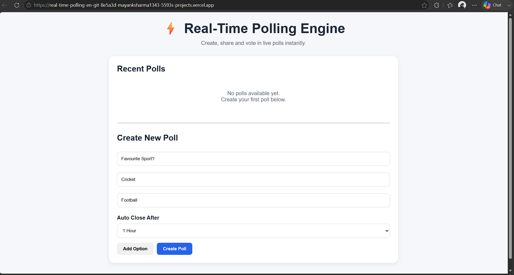

# ⚡ Real-Time Polling Engine

A full-stack real-time polling application that allows users to create polls, share them instantly, vote live, and view results without refreshing the page.

Built using React, Node.js, MongoDB, Express, and Socket.IO for real-time communication.

---

## 🚀 Live Demo

### Frontend
🔗 https://real-time-polling-en-git-8e5a3d-mayanksharma1343-5593s-projects.vercel.app/

### Backend API
🔗 https://real-time-polling-engine.onrender.com

### GitHub Repository
🔗 https://github.com/Mayank1343/Real-Time-Polling-Engine.git

---

## 📌 Features

### Poll Management
- Create polls with multiple options
- Share polls using a unique link
- Open and close polls manually
- Delete closed polls
- View recently created polls

### Real-Time Voting
- Live vote updates using Socket.IO
- No page refresh required
- All connected users receive instant updates

### Voting Security
- One vote per user/IP
- Duplicate vote prevention
- Input validation on both frontend and backend

### Poll Analytics
- Live vote count
- Vote percentage calculation
- Progress bar visualization
- Leading option display
- Total vote statistics

### Auto Poll Expiry
- Configure poll duration during creation
- Options include:
  - 5 Minutes
  - 30 Minutes
  - 1 Hour
  - 1 Day
- Polls automatically close after expiry time

### User Experience
- Responsive interface
- Loading spinner for API requests
- Clean dashboard view
- Shareable poll links
- Poll status indicators

---

## 🛠 Tech Stack

### Frontend

- React.js
- React Router DOM
- Axios
- Socket.IO Client
- CSS

### Backend

- Node.js
- Express.js
- Socket.IO
- MongoDB
- Mongoose

### Deployment

- Vercel (Frontend)
- Render (Backend)
- MongoDB Atlas (Database)

---

## 📂 Project Structure

```text
Real-Time-Polling-Engine
│
├── client
│   ├── src
│   │   ├── components
│   │   │   ├── Header.jsx
│   │   │   └── Loader.jsx
│   │   │
│   │   ├── pages
│   │   │   ├── CreatePoll.jsx
│   │   │   └── PollPage.jsx
│   │   │
│   │   ├── services
│   │   │   └── api.js
│   │   │
│   │   ├── App.jsx
│   │   └── main.jsx
│   │
│   └── package.json
│
├── server
│   ├── Controllers
│   │   └── pollController.js
│   │
│   ├── models
│   │   ├── Poll.js
│   │   └── Vote.js
│   │
│   ├── routes
│   │   └── pollRoutes.js
│   │
│   ├── db.js
│   └── server.js
│
└── README.md
```

---

## ⚙️ Installation

### Clone Repository

```bash
git clone https://github.com/Mayank1343/Real-Time-Polling-Engine.git

cd Real-Time-Polling-Engine
```

---

## Backend Setup

```bash
cd server

npm install
```

Create `.env`

```env
PORT=5000

MONGO_URI=your_mongodb_connection_string
```

Start backend:

```bash
npm run dev
```

---

## Frontend Setup

```bash
cd client

npm install
```

Create `.env`

```env
VITE_API_URL=http://localhost:5000/api
```

Start frontend:

```bash
npm run dev
```

---

## API Endpoints

### Create Poll

```http
POST /api/polls
```

Request:

```json
{
  "question": "Best Programming Language?",
  "options": ["Java", "Python", "JavaScript"],
  "duration": 60
}
```

---

### Get Poll

```http
GET /api/polls/:id
```

---

### Vote

```http
POST /api/polls/:id/vote
```

Request:

```json
{
  "optionIndex": 1
}
```

---

### Close Poll

```http
PATCH /api/polls/:id/close
```

---

### Get All Polls

```http
GET /api/polls
```

---

### Delete Poll

```http
DELETE /api/polls/:id
```

---

## 🔄 Real-Time Workflow

1. User creates a poll.
2. Poll is stored in MongoDB.
3. Shareable link is generated.
4. Users join the poll page.
5. Socket.IO connects users to a poll room.
6. Votes are submitted.
7. Backend updates MongoDB.
8. Updated poll data is broadcast instantly.
9. All connected clients receive live results.

---

## Why Socket.IO?

Traditional polling requires refreshing the page repeatedly.

Socket.IO enables:

- Real-time communication
- Instant vote updates
- Better user experience
- Reduced API requests
- Efficient room-based event broadcasting

---

## Challenges Faced & Solutions

### 1. MongoDB Authentication Errors

**Issue**

Database connection was failing due to incorrect Atlas credentials.

**Solution**

Configured a dedicated MongoDB Atlas user and updated the connection string.

---

### 2. Preventing Duplicate Votes

**Issue**

Users could vote multiple times.

**Solution**

Stored voter IP addresses and maintained a separate Vote collection to prevent duplicates.

---

### 3. Real-Time Synchronization

**Issue**

Votes were updating only after page refresh.

**Solution**

Implemented Socket.IO rooms and emitted poll updates after every vote.

---

### 4. Render Deployment Issues

**Issue**

Backend deployment failed due to incorrect project structure and module paths.

**Solution**

Updated Render configuration and fixed backend imports.

---

### 5. Poll Lifecycle Management

**Issue**

Polls remained active indefinitely.

**Solution**

Implemented auto-expiry timestamps and automatic poll closure.

---

## Future Improvements

- Authentication system
- Poll ownership
- Anonymous voting mode
- Multiple-choice polls
- Poll editing
- Email sharing
- Dark mode
- Vote history
- Admin dashboard

---

## Screenshots

### Dashboard



### Poll Creation

_Add screenshot here_

### Live Results

_Add screenshot here_

---

## Author

**Mayank Sharma**

B.Tech Computer Science Engineering

GitHub:
https://github.com/Mayank1343

LinkedIn:
https://www.linkedin.com/in/mayanksharmaa13/

---

## License

This project is developed for educational and learning purposes.